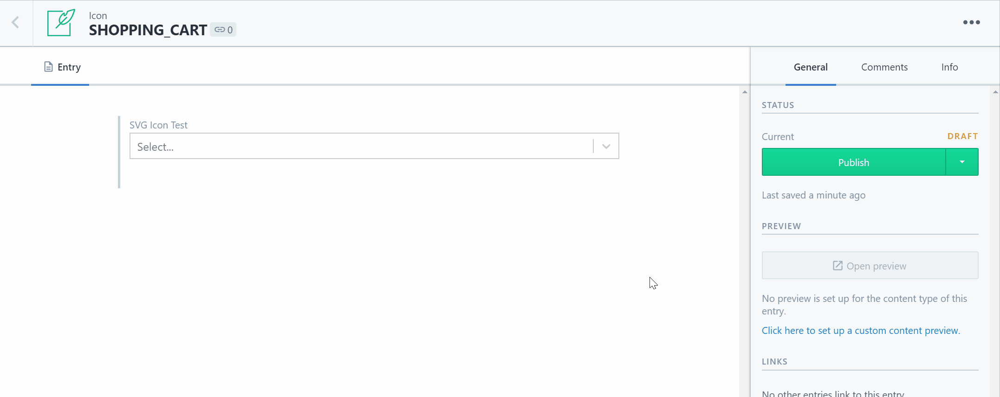

# Contentful UI Icon Selector

[](http://badges.mit-license.org)

A small and simple custom SVG Icon selector. The idea is that you map your Web App SVG Icons (as components) to this Contentful ui extension.



## 🚀 Getting started

```bash
git clone https://github.com/lukethacoder/contentful-ui-icon-selector.git
cd contentful-ui-icon-selector

yarn
# or npm i

yarn dev
# npm run dev
```

## 🗃️ Add your own Icons

To create your own set of icons, create a new \*.tsx file for each one inside the `./src/icons/` folder. The icons will then need to be imported in the `./src/icons/index.ts` file and assigned to the main `ICON` array.

> NOTE: Make sure each of your icons have `style={{ width: '100%', height: '100%' }}` added to the `<svg/>` element.

## 🤔 Gotchas

You may run into issues when attempting to run this in your Contentful environment due to insecure content (your localhost). The easiest solution is to run chrome with the `--allow-running-insecure-content` flag.

> also be sure to open your [localhost:1234](http://localhost:1234) in the browser too.

```bash
# Windows
"C:\Program Files (x86)\Google\Chrome\Application\chrome.exe" --allow-running-insecure-content

# MAC
'/Applications/Google Chrome.app/Contents/MacOS/Google Chrome' --allow-running-insecure-content
```

If you have any other major issues check out the official [create-contentful-extension docs](https://github.com/contentful/create-contentful-extension)

## 🛠️ Acknowledgements

Jed Watson & [react-select](https://github.com/JedWatson/react-select) which handles the bulk of the select magic.

Example SVG Icons by [Font Awesome](https://fontawesome.com/)

## 📝 License

Licensed under the [MIT License](./LICENSE).
